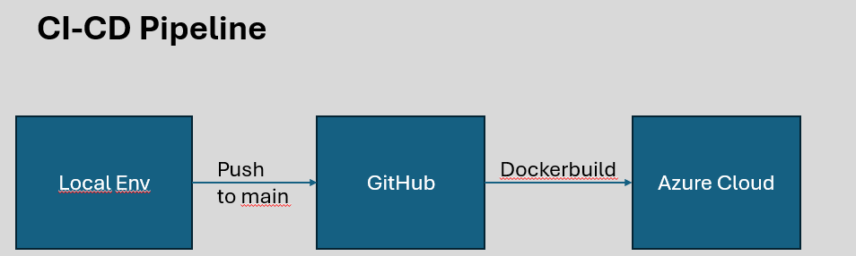

#Mdm Project 1 Brewery Db
Inhaltsverzeichnis:
1. Anforderungen 
2. Daten & Model Training
3. Architektur & CI / CD

##1. Anforderungen
| Kriterium | Bemerkung |
| -------- | -------- | 
| Datenquelle klar definiert|Siehe README 2.| 
| Scraping vorhanden | Nein |
| Datensatz vorhanden  | Siehe README 2.|
| Datensatz-Grösse ausreichend, Aufteilung Train/Test, Kennzahlen vorhanden |Siehe README 2. |
| Modell vorhanden  | Code TODO|
| App: auf lokalem Rechner gestartet und funktional  | StandaloneApplication starten|
| App mehrere unterschiedliche Testcases durch Reviewer ausführbar  | http://localhost:8080/ |
| Deployment: Falls bereits vorhanden, funktional und automatisiert vorhanden  |GitHubAction: ci-cd |
| Code: Git-Repository vorhanden, Arbeiten mit Branches / Commits| https://github.com/GsteigerDominik/djl-animal-classification |
| Code: Dependency Managment, Dockerfile, Build funktional  | Maven, Dockerfile, GitHubAction: ci-cd |
##2. Daten & Model Training
Folgendes Datenset wurde verwendet: https://www.kaggle.com/datasets/iamsouravbanerjee/animal-image-dataset-90-different-animals
Es beinhalted 5400 Bilder von Tieren wobei es 90 verschiedene Tiere (Classes/Categories) gibt.

Ziel ist es eine Image Classification von Tieren auf einer Webseite anzubieten.

Kategorie des Models: Neuronales Netzwerk
Verwendetes Model: ResNetV1
Anzahl Layers: 50

Anzahl Training: 50%
Anzahl Validation: 50%
Anzahl Epochen: 4
Accuracy: 15%

##3. Architektur & CI / CD

Link auf App:
https://djl-animal-classification.azurewebsites.net/
